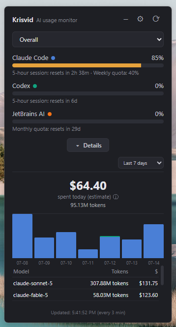

# Krisvid — AI Usage Monitor

Krisvid is a lightweight Windows, macOS, and Linux tray app that monitors AI coding-agent usage: plan limits and local token/cost statistics for [Claude Code](https://claude.com/claude-code), [OpenAI Codex](https://openai.com/codex/), and [JetBrains AI](https://www.jetbrains.com/ai/) (AI Assistant / Junie), without having to run `/usage` manually.

  

Repository: <https://github.com/zsoltjanes/Krisvid-AI-Usage-Monitor>



## Features

- **Multi-provider** — one block per installed tool (Claude Code, OpenAI Codex, and JetBrains AI), each with its own gauges, statistics, and account information. Every provider has an accent color (Claude blue, Codex green, JetBrains orange) shown as a dot next to its name and as its segment in the daily-cost chart.
- **Plan-limit gauges** — five-hour session and weekly quota usage, with reset countdowns refreshed every minute. Providers with a single window (JetBrains AI's monthly credit quota) show one gauge.
- **Combined view** — when more than one provider is installed, an *Overall* view sums cost and tokens and stacks each provider's color in the daily chart.
- **Local cost and token statistics** — reads local Claude and Codex transcripts and estimates per-model USD cost.
  - Today's spend and token count
  - Last seven days as a chart
  - Per-model breakdown for the last seven days
- **Tray-first UI** — a green, amber, or red tray indicator; click it to open a compact panel. Its position is remembered.
- **Multilingual UI** — Hungarian, English, German, French, and Spanish.
- **Resilient polling** — a failed or rate-limited request keeps the last known data visible and backs off automatically on HTTP 429.

## How it works

Each provider is read independently.

**Claude Code**

1. **Plan limits** — uses the OAuth token already stored by Claude Code in `~/.claude/.credentials.json` to call Anthropic's usage endpoint. This is not an official documented API and may change.
2. **Local statistics** — incrementally scans `~/.claude/projects/**/*.jsonl`, deduplicates streamed messages, and calculates token and cost estimates from response usage data.

**OpenAI Codex**

Codex data is read from local files only. The app scans rate-limit snapshots and token-count events in `~/.codex/sessions/**/*.jsonl`; account data is read locally from `~/.codex/auth.json`.

**JetBrains AI**

JetBrains data is read from local files only. The app reads the shared AI-credit quota that the IDE caches in `AIAssistantQuotaManager2.xml` (under the JetBrains config directory — `%APPDATA%\JetBrains\<IDE>` on Windows, `~/Library/Application Support/JetBrains/<IDE>` on macOS, `~/.config/JetBrains/<IDE>` on Linux), picking the most recently synced IDE. Only the monthly credit quota and its reset time are available — there is no per-request cost or token data — so the cost/chart/model sections stay empty for this provider.

No telemetry is collected. The only external request is the Anthropic usage request described above.

## Installing

Download the matching artifact from [Releases](../../releases):

- **Windows:** the `Krisvid Setup *.exe` installer.
- **macOS:** the `.dmg` disk image or `.zip` archive.
- **Linux:** the `.AppImage` or `.deb` package.

Alternatively, run it from source on any supported operating system:

```sh
git clone https://github.com/zsoltjanes/KRISVID-AI-Usage-Monitor.git
cd KRISVID-AI-Usage-Monitor
npm install
npm start
```

Requires Node.js and at least one supported tool installed and signed in: Claude Code (`~/.claude/.credentials.json`), OpenAI Codex (`~/.codex`), and/or a JetBrains IDE with AI Assistant / Junie (a cached `AIAssistantQuotaManager2.xml`).

> When running from a Claude Code terminal, unset `ELECTRON_RUN_AS_NODE` first. For example: `env -u ELECTRON_RUN_AS_NODE npm start` in bash, or clear the variable in PowerShell/cmd.

## Building packages

```sh
npm run dist
```

This generates the Windows ICO, macOS ICNS, and Linux PNG icons, then builds packages for the current operating system into `dist/`.

Build a particular target with:

```sh
npm run dist:win    # Windows NSIS installer
npm run dist:mac    # macOS DMG and ZIP; run this on macOS
npm run dist:linux  # Linux AppImage and DEB
```

For release builds, use a native CI runner for each platform. In particular, macOS packages must be built on macOS.

## Project layout

```
src/                 # Electron main process and provider implementations
renderer/            # panel UI
resources/           # source logo
scripts/
  generate-icon.js   # builds Windows, macOS, and Linux icons
```

## Configuration

- **Language:** Hungarian, English, German, French, or Spanish — change it from the panel settings. The setting is stored in Electron's platform-specific user-data directory.
- **Refresh interval:** choose 1–30 minutes (default: 3). HTTP 429 responses temporarily override this interval to avoid repeated requests.

## Disclaimer

This project is **not affiliated with or endorsed by Anthropic, OpenAI, or JetBrains**. Anthropic's usage endpoint is undocumented and may change or disappear, and the JetBrains quota file format is internal and may change. Use at your own risk; plan-limit values are estimates of the available data.

## License

[ISC](./LICENSE)
